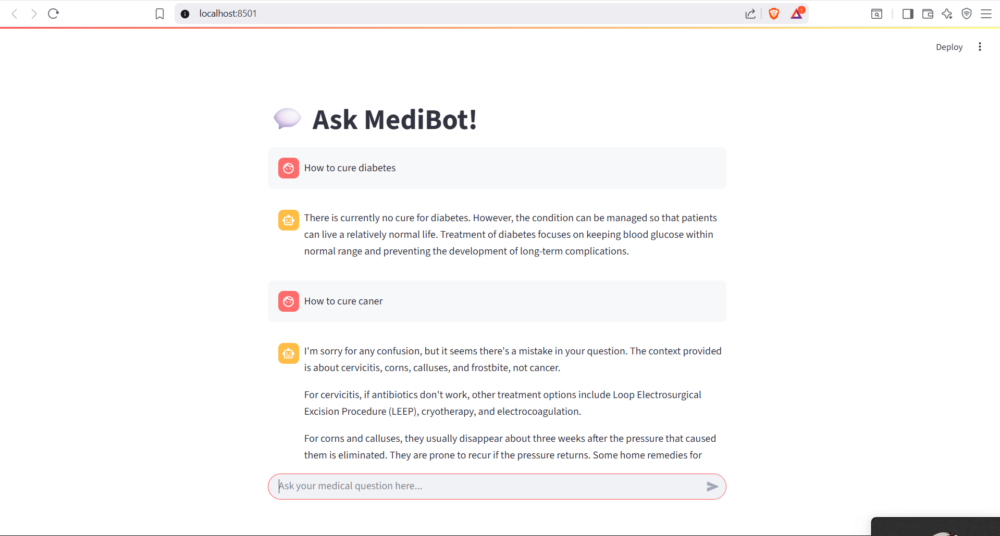

# 🩺 GenAI Medical Chatbot

The *GenAI Medical Chatbot* is an AI-powered conversational assistant designed to provide personalized medical information, symptom-based guidance, and healthcare support. Built using **Generative AI** and **Retrieval-Augmented Generation (RAG)**, this chatbot leverages large language models (LLMs) to deliver accurate and context-aware responses for patients, healthcare professionals, and researchers.This project aims to enhance health literacy and streamline access to medical advice.

---

## 📸 Preview

- Chat Interface



---

## 📌 Features

- ✅ **Symptom Checker**: Users can input symptoms, and the chatbot provides potential conditions and recommendations using NLP and medical datasets.
- ✅ **Medical Q&A**: Answers a wide range of medical queries with context-aware responses powered by RAG and LLMs.
- ✅ **Personalized Guidance**: Offers tailored advice based on user inputs, enhancing health literacy and decision-making.
- ✅ **24/7 Availability**: Provides instant responses to medical inquiries anytime, anywhere.
- ✅ **Integration Potential**: Designed to integrate with telemedicine services or healthcare APIs for future enhancements.

---

## 🧠 How It Works

### 📍 Architecture
- **Frontend**: A user-friendly interface (e.g., Streamlit or React) for interacting with the chatbot.
- **Backend**: Python-based server using FastAPI or Flask, integrated with LangChain for RAG and an LLM (e.g., Llama2, Mistral, or a fine-tuned model).
- **Data Processing**: Utilizes medical datasets and knowledge bases for accurate responses, with vector databases (e.g., FAISS) for efficient retrieval.

### 🛠 Workflow
1. **User Input**: Users describe symptoms or ask medical questions via the chat interface.
2. **Preprocessing**: Parse and analyze input, extracting key terms and context.
3. **Retrieval-Augmented Generation (RAG)**: Retrieves relevant medical data from a knowledge base or dataset using vector search.
4. **Response Generation**: The LLM generates accurate, context-aware responses, prioritizing reliability and clarity.

---

## 🛠 Tech Stack

| Component         | Technology                                    |
|-------------------|-----------------------------------------------|
| **Language**      | Python                                       |
| **Framework**     | FastAPI/Flask, LangChain, Streamlit (or React) |
| **LLM**           | Llama2, Mistral, or fine-tuned medical model  |
| **NLP**           | Hugging Face Transformers, Sentence Transformers |
| **Database**      | MongoDB Atlas, Pinecone, or FAISS (vector store) |
| **Other Tools**   | Pandas, NumPy, Scikit-learn, Matplotlib, Seaborn |

---

## ⚙ Setup & Installation

### 📝 Prerequisites
- Python 3.8+
- Git
- Optional: Docker for containerized deployment
- API keys for LLMs (e.g., Hugging Face) or local model setup
- FAISS for vector storage (if used)

### 📁 Clone the Repository
```bash
git clone https://github.com/utkarshsonpipre/GEN-AI-MEDICAL-CHAT-BOT.git
cd GenAI-Medical-Chatbot
```

### 🛠 Install Dependencies
1. Create a virtual environment (recommended):
   ```bash
   python -m venv venv
   source venv/bin/activate  # On Windows: venv\Scripts\activate
   ```
2. Install required packages:
   ```bash
   pip install -r requirements.txt
   ```

### 📊 Dataset Setup
- The chatbot uses a medical dataset or knowledge base (e.g., a subset of the AI Medical Chatbot dataset or Gale Encyclopedia of Medicine).[](https://github.com/ruslanmv/ai-medical-chatbot)[](https://github.com/abhroroy365/Medical-Chatbot)
- Place the dataset in the `data/` folder or configure the script to fetch it automatically (e.g., via Hugging Face datasets).
- For RAG, initialize the vector store with preprocessed medical data.

### 🚀 Run the Chatbot
1. Start the backend server :

2. Launch the frontend (if using Streamlit):
   ```bash
   streamlit run medibot.py
   ```
3. Access the chatbot at `http://localhost:8501` (Streamlit) or the specified port for other interfaces.

---

## 📂 Project Structure

```
GenAI-Medical-Chatbot/
├── data/                           # Medical datasets or knowledge base
├── vectorstore/                    # Data preprocessing and vector store setup
├── connect_memory_with_llm.py      # Backend server (FastAPI/Flask)
├── medibot.py                      # Frontend interface (Streamlit)
├── create_memory_for_llm.py        # RAG implementation with LangChain
├── requirements.txt                # Python dependencies
└── README.md                       # Project documentation

```

---

## ⚠️ Disclaimer

This chatbot is for informational purposes only and should not be used as a substitute for professional medical advice, diagnosis, or treatment. Always consult a qualified healthcare provider for medical concerns.
